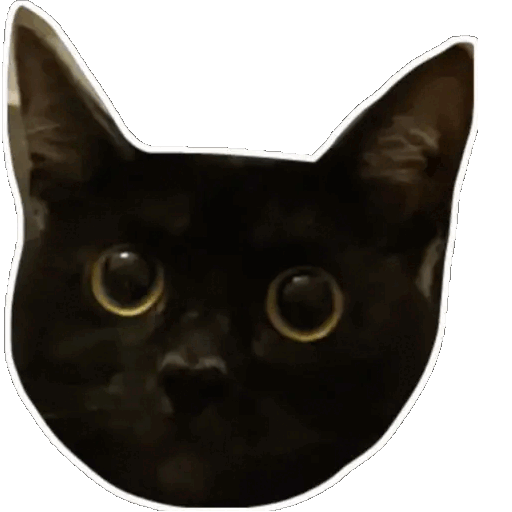

# Luna Jump
*This game was written as a final project for the 'Programming in C++' course at HWR Berlin.*

## About
Luna Jump is a game inspired by the Google Chrome Dino Jump game (try it by visiting a website using chrome without internet connection). The player character is one of my cats (Luna) and the obstacles are different pictures of my other cat (Lilo). The game has a trashy design on purpose, to go with the rather silly idea of using funny cat pictures as sprites.

## How to install
### For Windows
Download the archive from the releases page, unzip and open `LunaJump.exe`. 
Alternatively rightclick the .exe -> create shortcut -> move shortcut to desired location.

### For other platforms
There is no provided release archive for other platforms. Download the sourcecode from the releases page and build from source yourself.

## How to build from source/Dev setup
Download sourcecode from github via clone or from a release zip.

Install SFML for your platform/IDE as outlined in https://www.sfml-dev.org/tutorials/2.6/#getting-started. This project uses the graphics, system and window modules.

Compile/build the project according to your IDEs/platforms specifications. Consult documentation of your desired build tooling please.

## Third party assets
Background image (modified to fit window dimensions):
https://opengameart.org/content/bevouliin-free-mountain-game-background-for-game-developers

SFML library:
https://www.sfml-dev.org/
